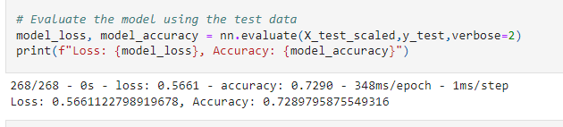
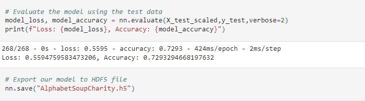

# Neural_Network_Charity_Analysis
## Overview of Project
> The purpose of the project is the using Tensorflow and neural networks in jupyter-notebook to analyze and come up with results of charitable donations.
#### Methodology
* Preparing the data for the model
* Fit transform
* Apply a model
* Compile
* Export output
* Use the different algorithm to make better accuracy
## Results
> First we drop the irrelevant columns. Then determination was made by the graph of application counts to replace them less 500. Same method applied to classification counts. Then categorical data was encoded to fit the transform. Since we have Is_Succesful column we set as targeted value and split into the test variables. Also Standardization was applied to non-binary columns. With two hidden layers (80 and 30 neurons), with the relu activation, neurol network model was applied and compiled. The results was fitted with 100 epochs and gave the % 72.93 accuracy.  
> 
 
### Optimization
> To achieve better results same process with different methods were applied.
* Attempt 1 Increase hidden layers and neurons 
** Accuracy %72.90 achieved
* Attempt 2 changing the activation function with additional hidden layer
** Accuracy % 72.82 was achieved
* Attempt 3 increasing the neurons
** Accuracy %72.9 was achieved.  

 
## Summary 
> Overall results, expected %75 goal could not achieved with this methods. However more deep neural network analysis and different solutions are still promising. Since it is hard to get perfect data before Neural Network analysis, we need to apply more cleaning and deep learning to retrieving a clear set of data. This process also open for other machine learning methods. Especially when we know the targeted set, it is easy to train the model.
